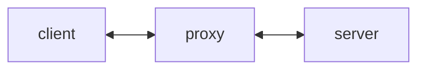
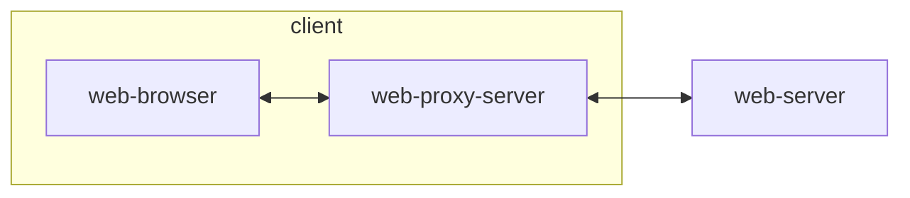

# 웹 해킹에 대한 이해
## 1) 웹 해킹이란 무엇인가?
웹 서비스 상에서 발생될 수 있는 모든 보안 허점을 이용해 악의적인 행위를 하는 것

## 2) 해커들의 공격 맛집, 웹 서비스
* 방화벽 / 웹 방화벽 도입 -> 해킹 증가
* 유일한 공격 경로 = 웹 서비스

## 3) 웹 해킹을 통한 피해 영역
* 클라이언트 공격
* 웹서버(대외 서비스)
* 사설망(대내 서비스)
* 오피스 망

## 4) 웹 해킹이 발생하는 원인
* 입력 값 검증 부재
* 취약한 인증 및 접근 통재
* 중요 정보 노출
* 부적절한 설정
* 서버 / 프레임워크 취약점

## 5) 웹 해킹 필수 도그, 웹 프록시
* 프록시란 무엇인가?

클라이언트와 서버 사이에서 통신을 중계

* 종류
    * 포워드 프록시
    * 리버스 프록시
    * 오픈 프록시

* 웹 프록시 구조

`web-proxy-server`를 통해 요청/응답을 위.변조

* 웹 프록시 종류
    * 버프 스위트(Burp Suite)
    * 파로스(Paros)
    * 피들러(Fiddler)
    * ZAP