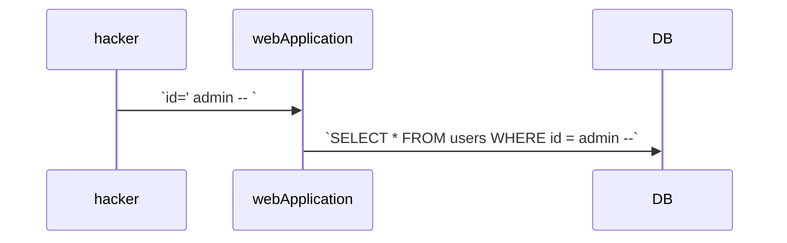

# SQL Injection
## 1) SQL Injection이란 무엇인가?
* 일반 입력 또는 양식 필드에 SQL 쿼리를 삽입하여 애플리케이션 코드의 취약성을 악용하려고 시도하는 공격 유형

## 2) 취약점 발생 원인
* 미비한 사용자 입력 값 검증 

## 3) 공격의 종류
* 인증 우회 공격
* 데이터 조회, 조작 공격
* 시스템 명령어 실행 공격

## 4) 인증 우회 공격이란 무엇인가?
* 정상적인 아이디가 아닌 SQL 구문 삽입

## 5) 인증 우회 공격 원리
1) SQL 구문 삽입 `id= ' or 1=1 -- `
2) 로그인 시도 - 아이디 패스워드 전송
3) 사용자 입력 값을 통한 SQL 구문 완성 `SELECT * FROM users WHERE id ='' or 1=1--'`

### 예시
1. Terminating Query: `--`을 사용하여 주석처리를 이용
2. In-line Query: 
   * `admin' or '1'='1`
   * `SELECT * FROM users WHERE id = 'admin' or '1'='1' and pw=`