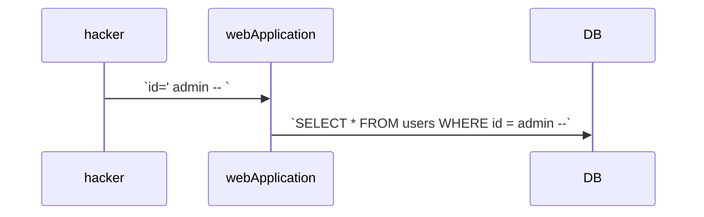

# SQL Injection
## 1) SQL Injection이란 무엇인가?
* 일반 입력 또는 양식 필드에 SQL 쿼리를 삽입하여 애플리케이션 코드의 취약성을 악용하려고 시도하는 공격 유형

## 2) 취약점 발생 원인
* 미비한 사용자 입력 값 검증 

## 3) 공격의 종류
* 인증 우회 공격
* 데이터 조회, 조작 공격
* 시스템 명령어 실행 공격

## 4) 인증 우회 공격이란 무엇인가?
* 정상적인 아이디가 아닌 SQL 구문 삽입



## 5) 인증 우회 공격 원리
1) SQL 구문 삽입 `id= ' or 1=1 -- `
2) 로그인 시도 - 아이디 패스워드 전송
3) 사용자 입력 값을 통한 SQL 구문 완성 `SELECT * FROM users WHERE id ='' or 1=1--'`

### 예시
1. Terminating Query: `--`을 사용하여 주석처리를 이용
2. In-line Query: 
   * `admin' or '1'='1`
   * `SELECT * FROM users WHERE id = 'admin' or '1'='1' and pw=`

## 6) 데이터 조회 공격이란 무엇인가?
* 애플리케이션이 의도하지 않은 데이터를 조회하도록 조작하는 공격 유형

## 7) 데이터 조회 공격 기법 종류
* Error-Based
* Blind-Based
* Union-Based
* Out-of-band(OOB)

## 8) Union-Based 공격이란 무엇인가?
* `UNION` 구문을 이용해 공격자가 원하는 다른 쿼리를 결합해 정보를 노출시키는 공격 유형

## 9) Blind-Based 공격이란 무엇인가?
* 공격자가 `직접적인 응답 결과를 볼 수 없는 상황`에서, 간접적인 변화(시간, 참/거짓, 동작 여부 등)를 이용해 정보를 추론하는 공격 유형

## 10) 대응 방안 개요
* 시큐어 코딩
  * Prepared Statement 사용
  * 사용자 입력 검증 로직 구현
  * 길이 제한
* 인라인 보안솔루션 적용

## 11) 대응 방안(1) - Prepared Statement 사용
* 취약한 소스 코드 예시
```java
String keyword = request.getParameter("keyword");
String sql = "SELECT * FROM board WHERE content LIKE" + "'%" + keyword + "%';
stmt = conn.prepareStatement(sql);
rs = stmt.executeQuery(query);
```

* Prepared Statement 소스 코드 예시
```java
String keyword = request.getParameter("keyword");
String sql = "SELECT * FROM board WHERE content LIKE ?";
stmt = conn.prepareStatement(sql);
stmt.setString(1, "%" + keyword + "%");
rs = stmt.executeQuery();
```

## 12) 대응 방안(2) - 사용자 입력 검증 로직 구현
* 숫자형 검증 코드 예시
```java
boolean isNumber = Patter.matches("^[0-9]*$", seq);

if (!isNumber) {
    throw new IllegalArgumentException("유효하지 않은 값입니다.");
}
```
* 문자형 검증 코드 예시
```java
// MSSQL, ORACLE 예시
String keyword = request.getParameter("keyword");
keyword = keyword.replace("'", "''");
keyword = keyword.replace("\"", "\"\"");
```


## 13) 대응 방안(3) - 길이 제한
```java
String gubun = request.getParameter("gubun");
if (gubun.length() > 15) {  
    throw new IllegalArgumentException("유효하지 않은 값입니다.");
}
```