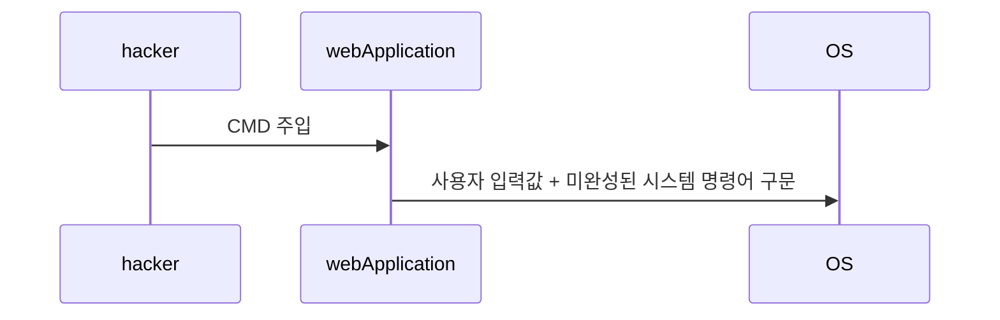

# OS Command Injection
## 1) OS Command Injection이란 무엇인가?
* 사용자 입력이 쉘 명령어 컨텍스트로 흘러들어가 명령 실행 권한을 탈취하는 취약점

## 2) 공격 대상
* 입력값을 검증 없이 쉘로 넘기는 애플리케이션이 가진 OS 명령 실행 권한

## 3) 공격 원리 분석

## 4) 대응 방안
* 서버 사이드 스크립트로 기능 구현
* 사용자 입력 값 형식에 따른 정규 표현식 검증
* 악의적인 문자 검증
* 기능 제거