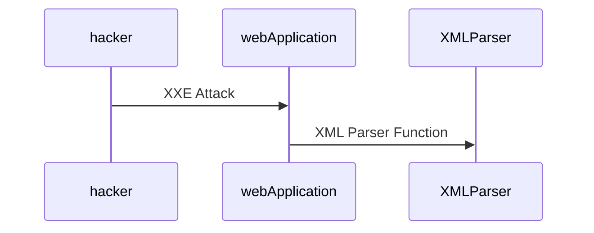
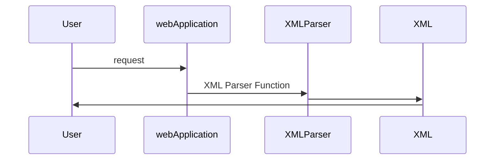
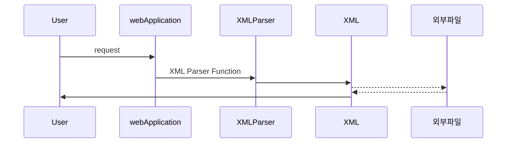

# XXE Injection
## 1) XXE Injection이란 무엇인가?
* `X`ML E`x`ternal `E`ntity
* XML 외부 개체 주입

## 2) 공격 대상

* JSON 이전 XML을 사용하던 레거시 시스템이 공격대상이 된다.

## 3) 공격 원리 분석
* 정상적인 XML Parser 예시

* 비정상적인 XML Parser 예시

* 내부 엔티티 사용
```xml
<?xml version="1.0" encoding="UTF-8"?>
<!DOCTYPE test[
    <!ENTITY str "[문자열]">
]>
<result>&str;</result>
```
* 외부 엔티티 사용
```xml
<?xml version="1.0" encoding="UTF-8"?>
<!DOCTYPE test[
    <!ENTITY str SYSTEM "file:///[경로]">
]>
<result>&str;</result>
```

## 4) 대응 방안
* JSON 데이터 형식으로 기능 구현
* DTD 및 외부 엔티티 비활성화