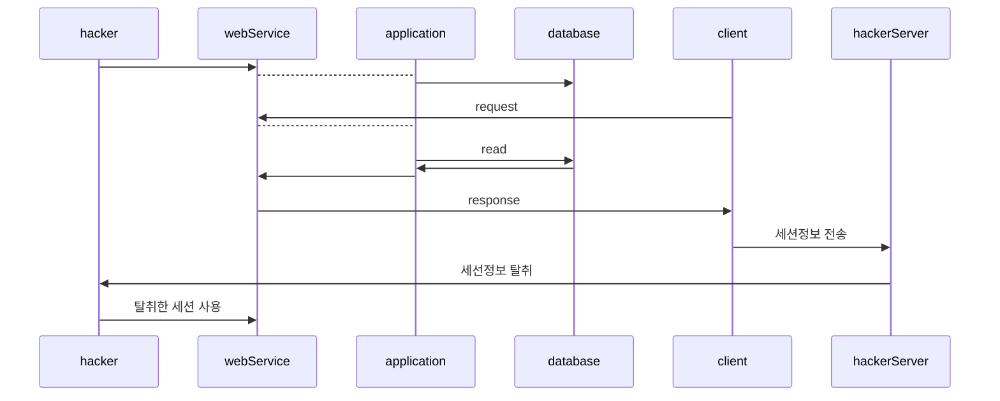
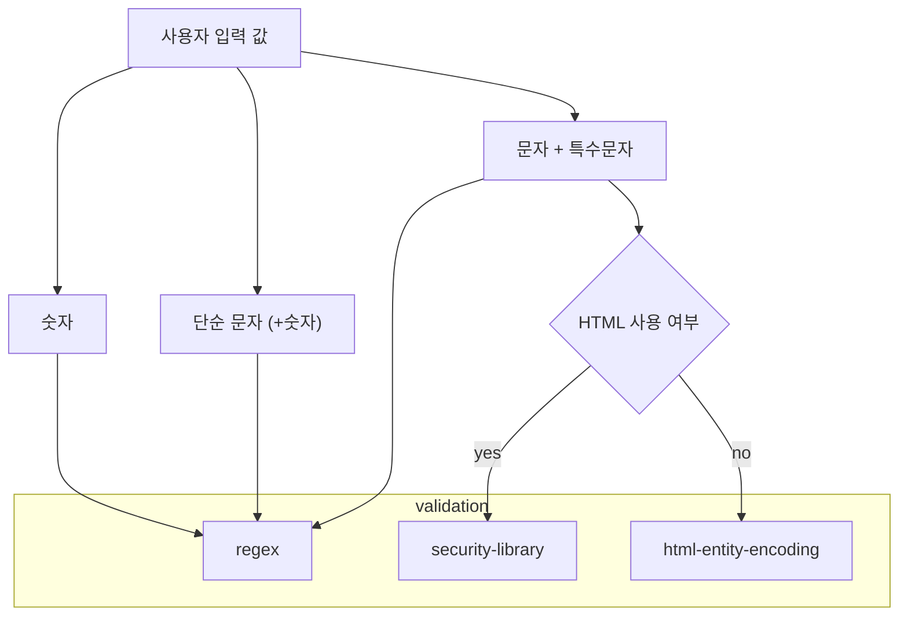

# XSS
## 1) XSS란 무엇인가?
* Cross-Site Scripting
* 공격자가 악성 스크립트를 웹페이지에 주입해, 다른 사용자의 브라우저에서 실행되도록 만들어 정보를 탈취나 세션 하이재킹을 일으키는 취약점이다.

## 2) 공격 대상
* 기능적인 공격 대상: 사용자 입력값으로 동적으로 생성되는 모든 페이지

* 엔드 포인트 단의 공격 대상

## 3) 공격 유형
* 피싱: 악의적인 사용자가 유도한 사이트로 리다이렉트
* 악성코드 유포: 강제 악성코드 다운로드 및 실행
* XSS Tunnel: 사용자 웹브라우저 권한 획득
* 세션 하이재킹: 사용자 세션, 권한 탈취
* CSRF: 악성 스크립트에 의해 악의적인 사용자가 의도한 행위를 함

## 4) 공격 기법
* DOM-Based XSS: 웹 브라우저에서 사용자 입력 값을 통해 동적 페이지 구성
* Reflected XSS: 서버측에서 사용자 입력 값을 통한 동적 페이지 구성
* Stored XSS: 데이터베이스에 저장된 데이터를 통한 동적 페이지 구성

|공격종류       | 입력 받는 위치       | 
|-------------|-------------------|
|DOM-Based XSS| Web Browser       |
|Reflected XSS| Application       |
|Stored XSS   | Back-End Database |

## 5) 공격 원리 분석
* DOM-Based XSS

* Reflected XSS

* STORED XSS

## 6) 세션 하이재킹에 대한 이해와 공격 원리 분석
* 세션 탈취를 통해 아이디, 패스워드를 몰라도 사용자 계정 도용

## 7) 대응 방안
* 대응하기 까다로운 XSS 취약점
  * 보안과 서비스성은 트레이드 오프 관계

* 입력 값 용도에 따른 대응 프로세스 수립

* HTML Entity Encoding

| 문자 | 엔티티                 |
|----|---------------------|
| `&`  | `&amp;`             |
| `<`  | `&lt;`              |
| `>`  | `gt;`               |
| `"`  | `&#34;` 혹은 `&quot;` |
| `'`  | `&#39;` 혹은 `&apos`  |
| `(`  | `&#40;`             |
| `)`  | `&#41; `             |