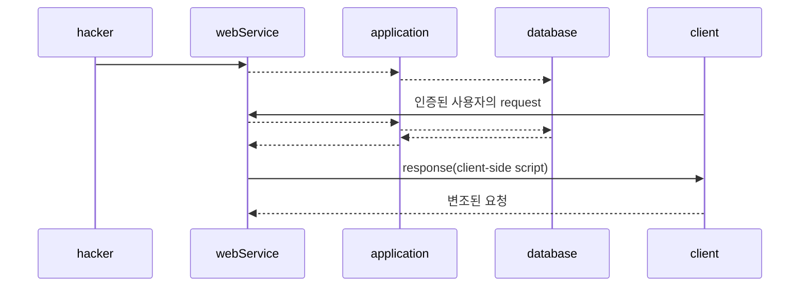
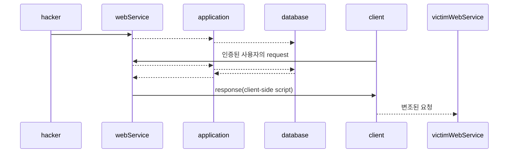

# CSRF
## 1) CSRF란 무엇인가?
Cross-Site Request Forgery
* 사용자가 로그인된 상태를 악용해서, 사용자의 의도와 무관한 요청을 서버에 보내게 만드는 공격.

## 2) 공격 원리 분석

## 3) XSS vs CSRF
* XSS
  * 공격 대상: 사용자
* CSRF
  * 공격 대상: 서버

## 4) 대응 방안
* Referer 값 검증
* CSRF Token 사용
* 인증 로직 사용 / CAPCHA 사용
* SameSite Cookie
