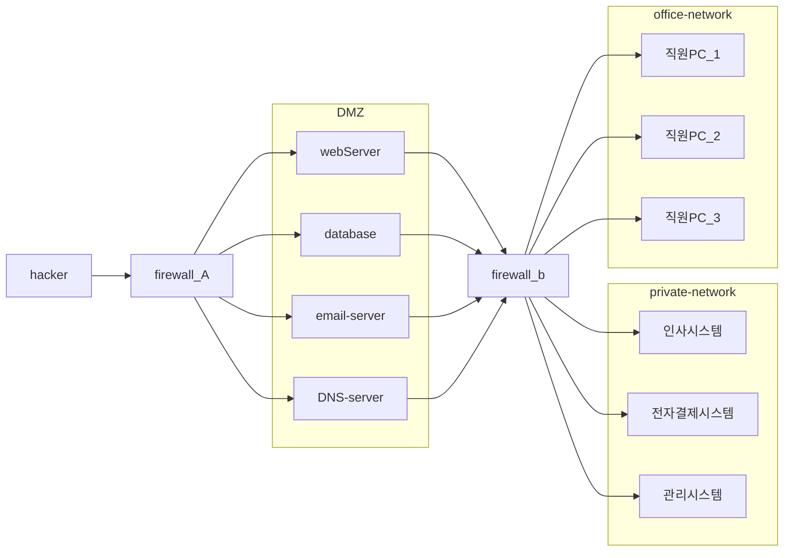
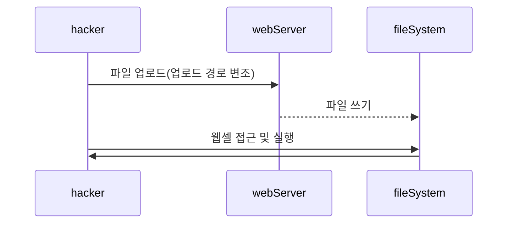

# 파일 업로드 취약점
## 1) 파일 업로드 취약점이란 무엇인가?
업로드되는 파일을 제대로 검증하지 않아서, 공격자가 악성 파일(웹셸, 스크립트 등)을 업로드하고 서버에서 실행할 수 있게 되는 취약점

## 2) 공격 원리 분석

## 3) 웹 쉘이란 무엇인가?
* `Web` + `Shell` = 웹 페이지 상에서 원격지 서버의 시스템 명령어를 실행할 수 있는 도구
* 언어별 시스템 함수

## 4) 검증 로직 유형
* 확장자 검증
* 이미지 검증
* 파일 사이즈 검증

## 5) 확장자 검증 방식에 대한 이해
* 블랙 리스트 방식
  * 장점
    * 다양한 파일 업로드 가능
  * 단점
    * 다양한 우회 가능성 존재
* 화이트 리스트 방식
  * 장점
    * 우회 가능성이 제한적
  * 단점
    * 다양한 파일 업로드 불가능

* 검증 동작 원리
1. 파일 업로드
2. 확장자 파싱
3. 확장자 검증
4. 파일 저장 여부 결정
5. 파일 저장

## 6) 대응 방안
* 파일명에 대한 검증
* 올바른 업로드 경로 설정