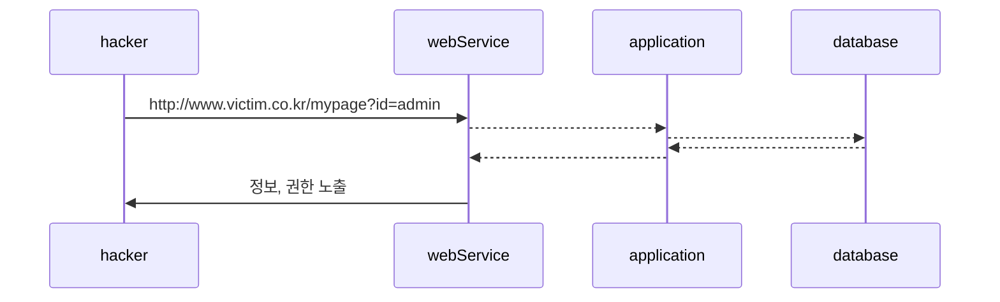
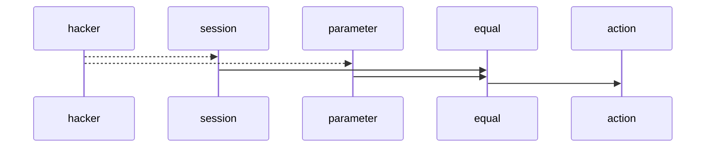

# 파라미터 변조 취약점
## 1) 파라미터 변조 취약점이란 무엇인가?
공격자가 요청 파라미터 값을 임의로 수정(변조) 해서, 원래 의도하지 않은 권한·데이터·금전적 이득을 얻는 공격

## 2) 공격 원리 분석

```mermaid
sequenceDiagram
    participant hacker
    participant webService
    participant application
    participant database

    hacker ->> webService: http://www.victim.co.kr/mypage?id=admin
    webService -->> application:  
    application -->> database: 
    database -->> application: 
    application -->> webService: 
    webService ->> hacker: 정보, 권한 노출 
    
```

## 3) 대응 방안
* 사용자 입력 값을 반드시 받아서 처리를 해야 되는 경우

```mermaid
sequenceDiagram
    participant hacker
    participant session
    participant parameter
    participant equal
    participant action
    
    hacker -->> session: 
    hacker -->> parameter: 
    session ->> equal: 
    parameter ->> equal: 
    equal ->> action: 
```