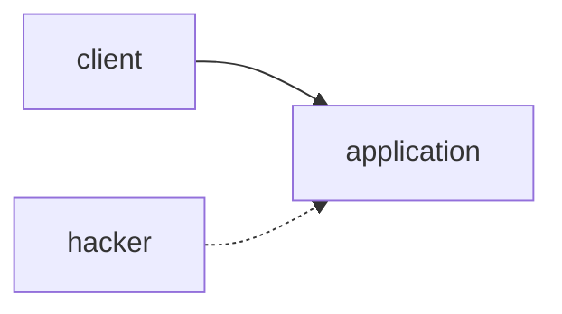
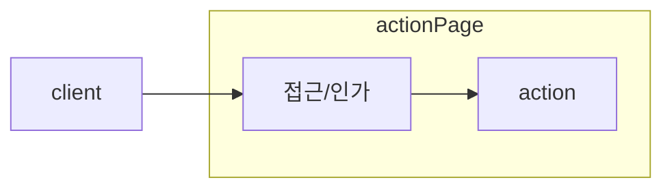

# URL 접근 제한 미흡 취약점
## 1) URL 접근 제한 미흡 취약점이란 무엇인가?
인증·인가 접근 제어(Authorization)를 제대로 하지 않아서 권한 없는 사용자가 특정 URL에 직접 접근할 수 있는 취약점

## 2) 인증과 인가에 대한 이해
* Authentication: 인증
  * 누구 인가
* Authorization: 인가
  * 어떤 권한을 가지고 있나

## 3) 공격 원리

## 4) 대응 방안
